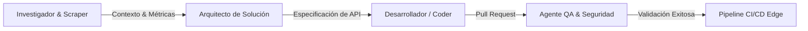

## De Copilotos Pasivos a Equipos Autónomos de IA 🚀🤖

Durante años, la inteligencia artificial en el desarrollo de software operó bajo el modelo de *asistencia reactiva*: un desarrollador humano escribía prompts y el modelo devolvía fragmentos de código o sugerencias aisladas. Sin embargo, en pleno **2026**, la industria ha dado un salto cualitativo definitivo: la transición hacia **agentes autónomos integrados como miembros activos del equipo de ingeniería**.

Esta evolución no solo transforma el flujo de trabajo diario, sino que está forzando un rediseño completo de la infraestructura cloud moderna.

---

## 1. Líneas de Ensamblaje Digital y Coordinación Agente a Agente (A2A)

La ventaja competitiva actual no reside en el tamaño bruto del modelo fundacional, sino en la **orquestación de flujos multitarea**. Hoy en día, los sistemas de producción emplean arquitecturas de coordinación **Agente a Agente (A2A)** estructuradas como líneas de montaje digital:

En este esquema, los ingenieros humanos asumen el rol de **Directores de IA**, supervisando objetivos de alto nivel, políticas de gobernanza y directrices de seguridad, mientras que las flotas de agentes ejecutan las tareas operativas de forma continua y verificable.

---

## 2. El Cierre de la Brecha de Infraestructura: Nativas de IA y Protocolos Abiertos

La proliferación de agentes expuso rápidamente las limitaciones de la infraestructura tradicional basada únicamente en peticiones HTTP efímeras. Las cargas de trabajo agénticas son intrínsecamente **stateful**, persistentes y de razonamiento intensivo.

### Pilares de la Nueva Infraestructura Cloud:
1. **Adopción Masiva del Model Context Protocol (MCP):** Estandarización del acceso seguro a herramientas, bases de datos y APIs externas sin acoplarse a un proveedor de LLM específico.
2. **Ejecución Distribuida en el Edge:** Para mitigar la latencia y optimizar el consumo energético, la toma de decisiones agéntica se despliega cerca del usuario final a través de redes globales como Cloudflare Pages y Workers.
3. **Economía de Tokens y Billing de Precisión:** La transición de costos fijos por servidor a esquemas dinámicos basados en consumo de tokens y tiempo de inferencia en hardware especializado (TPUs y GPUs de nueva generación).

---

## 3. Seguridad y Gobernanza: El Principio de Mínimo Privilegio Agéntico

A medida que los agentes asumen responsabilidades en entornos productivos (ejecutar migraciones de bases de datos, gestionar despliegues o actualizar dependencias), la seguridad se convierte en el pilar crítico:

* **Control de Alcance Fijo por Sesión:** Tokens restringidos por organización que impiden accesos transversales no autorizados.
* **Auditoría y Trazabilidad:** Registro inmutable de cada decisión tomada por un subagente antes de tocar producción.
* **Defensa Proactiva Automatizada:** Agentes de ciberseguridad dedicados al análisis estático en tiempo real contra inyecciones de prompt o elevación de privilegios en herramientas integradas.

---

## 4. La Visión en Dataclouder

En **Dataclouder**, integramos esta filosofía en cada capa de nuestra plataforma. Desde la redacción automatizada y optimizada para SEO hasta el aprovisionamiento de pipelines y microservicios serverless, demostramos que la colaboración hombre-máquina es el estándar definitivo del software moderno.

---

> [!TIP]
> ¿Quieres conocer más sobre cómo desplegar tus propios agentes y pipelines en Cloudflare y GitHub? Mantente atento a nuestras próximas guías técnicas y síguenos en el blog oficial de Dataclouder.
